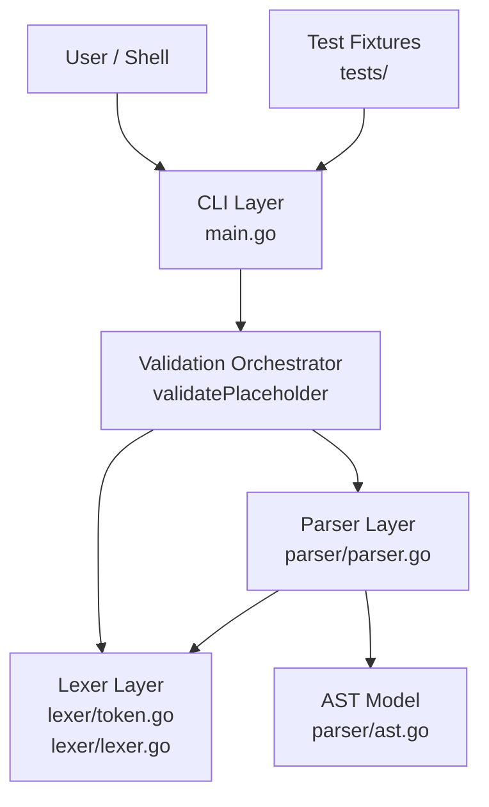
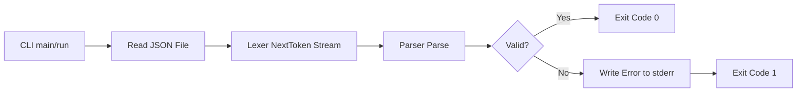
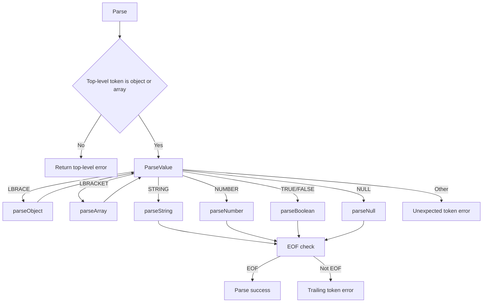
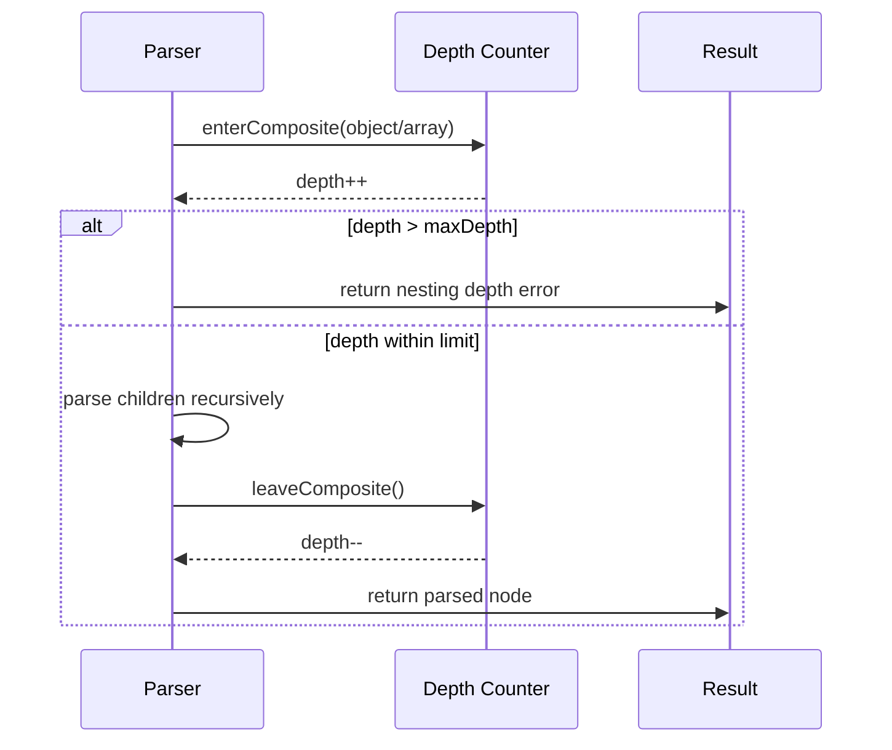

# Cuneiform Architecture

## Overview

Cuneiform is a command-line JSON validator implemented as a small, layered pipeline:

1. CLI entrypoint reads one file path and file content.
2. Lexer converts raw bytes into JSON tokens.
3. Parser consumes tokens and validates syntax using recursive descent.
4. Parser returns success or error.
5. CLI maps parser result to process exit code.

This design keeps I/O concerns separate from language-processing concerns.

## Component Diagram

## High-Level Flow

1. main calls run(args, stderr).
2. run validates argument count and reads file bytes.
3. run calls validatePlaceholder(data).
4. validatePlaceholder creates lexer and parser instances.
5. parser.Parse validates top-level shape and recursively parses the document.
6. parse success returns exit code 0; parse failure prints error and returns exit code 1.

## Components

## 1) CLI Layer

Files:
- main.go

Responsibilities:
- enforce command contract: exactly one input file
- read file content
- call validator pipeline
- map failures to stderr + non-zero exit code

What it does not do:
- token-level parsing
- syntax rules

## 2) Lexer Layer

Files:
- lexer/token.go
- lexer/lexer.go

Responsibilities:
- tokenize JSON punctuation, literals, and keywords
- skip whitespace
- validate number shape
- validate string escape syntax

Output:
- stream of Token objects consumed by parser

Error strategy:
- invalid lexemes are emitted as Illegal tokens
- parser treats Illegal token as unexpected input and fails

## 3) Parser Layer

Files:
- parser/parser.go
- parser/ast.go

Responsibilities:
- enforce top-level JSON document rule: object or array only
- parse objects, arrays, and primitive values
- enforce commas/colons and structural closures
- enforce maximum nesting depth
- construct AST nodes while validating syntax

Error strategy:
- fail fast on first parse error
- append error to parser error list for introspection

## Architectural Decisions

1. Recursive descent parser
- Why: straightforward mapping from JSON grammar to readable Go code.
- Tradeoff: recursion depth must be guarded to avoid runaway nesting and stack pressure.

2. Lexer-first validation with Illegal tokens
- Why: keeps lexical validation localized and parser simpler.
- Tradeoff: some diagnostics are less specific than a fully typed lexical error hierarchy.

3. Top-level payload restriction (object or array)
- Why: aligns with project expectations and fixture corpus behavior.
- Tradeoff: valid JSON primitives at top-level (allowed by RFC 8259) are intentionally rejected.

4. Depth guard in parser
- Why: protects parser from excessively deep nested documents.
- Tradeoff: hard limit can reject otherwise valid but deeply nested documents.

5. Minimal CLI and no config surface
- Why: keeps tool simple and test-focused.
- Tradeoff: no runtime customization for parser options (like max depth).

## Tradeoffs and Alternatives

Current approach:
- Manual lexer and parser implementation.

Alternative:
- Use encoding/json decoder only for validation.

Why current approach was chosen:
- educational value and control over grammar behavior.
- supports explicit parser-level constraints (for example depth rules) and corpus-driven evolution.

Tradeoffs:
- More implementation and maintenance effort.
- More edge cases to handle manually.

## Limitations

1. Position metadata is present in AST types but not populated from lexer/parser yet.
2. Error reporting is mostly first-error and message-based; it lacks rich diagnostics (line/column spans).
3. Max nesting depth is fixed in code and not configurable by CLI flag or env var.
4. String handling validates escape syntax but currently does not decode escape sequences into normalized rune values.
5. Parser is validation-oriented and not yet optimized for streaming or very large inputs.

## Extensibility Notes

Likely next extension points:
- configurable parser options (max depth, strictness mode)
- richer error objects with line and column
- AST consumers (formatter, transformer, semantic checks)
- optional support for top-level primitive JSON values if desired

## Testing Strategy (Architecture-Level)

The project uses fixture-driven acceptance tests in main_test.go.

Properties of this strategy:
- validates end-to-end behavior through CLI path
- ensures lexer + parser + CLI integration correctness
- easy to grow by adding fixture files

Recommended complement:
- add focused lexer and parser unit tests for tighter failure localization.
